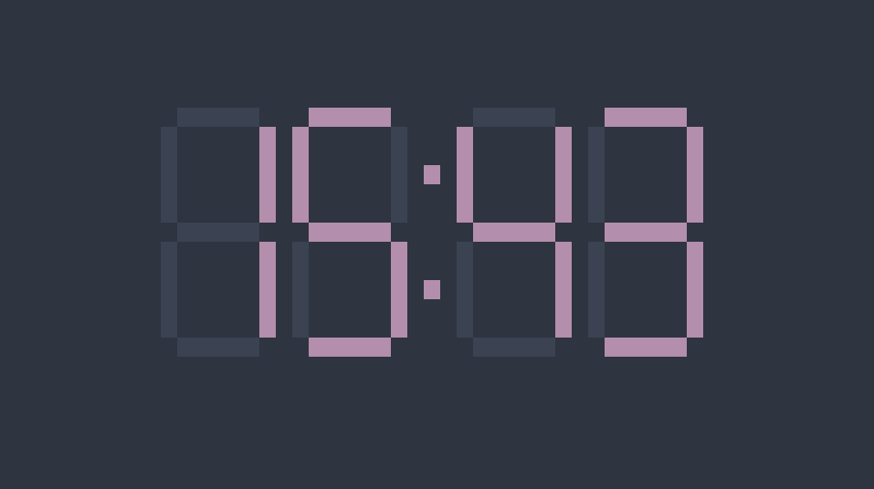

# Clock
A seven-segment clock with a TUI frontend using [cursive](https://github.com/gyscos/cursive).

## Installation
1. clone the repository and enter it: `git clone https://gitlab.com/mWalrus/clock-rs && cd clock-rs`
2. run cargo make: `sudo make all`

## Configuration
Configuration is made in the source since it doesn't really make sense to handle config files for such a small project.

In `src/main.rs` you can find the variables `ON_COLOR` and `OFF_COLOR` at the top. These decide the color of the segments when they're on or off.
Change these to your liking and re-run `sudo make all` to apply your changes.